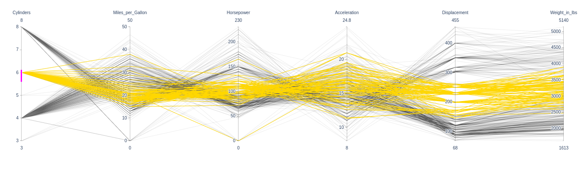

# Data Visualization




This project has two steps :

1. Show that data visualization with large amount of data is not obvious as the plot are illegible.
2. Find a better representation to visualize the data so that it is understandable.

All explanations can be found in the notebook.

# Usage

The project is in the *visualization.ipynb* notebook.

```
$ cd Data-Visualization/
$ jupyter notebook
```

# Languages and tools


# Contributors

- Adrien ANTON LUDWIG
- Adèle PLUQUET
